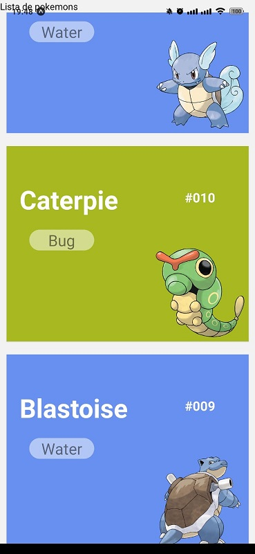
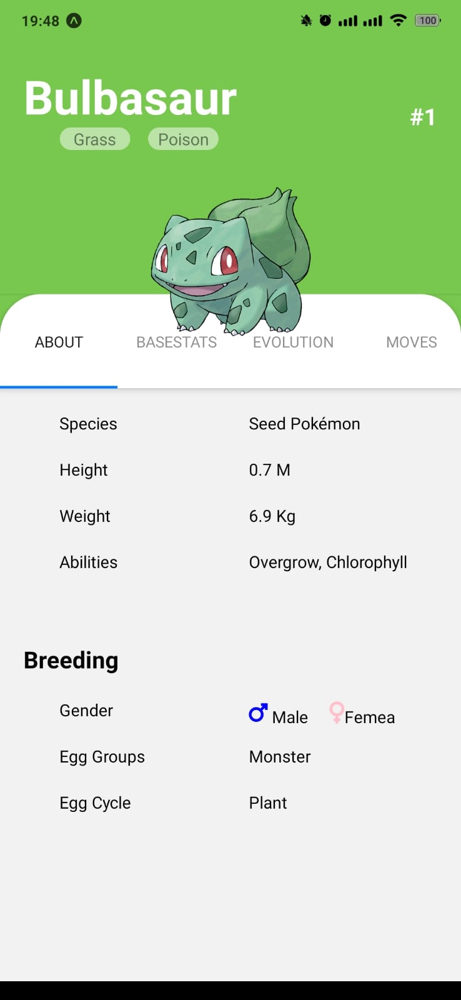
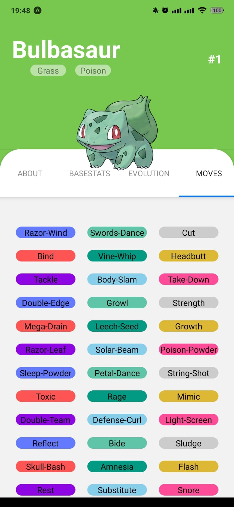

# Pokedex React Native

## App que mostra pokemons e seus respectivos perfis

### 🛠 Tecnologias

As seguintes ferramentas foram usadas na construção do projeto:

- [Expo](https://expo.dev/)
- [React](https://pt-br.reactjs.org/)
- [React Native](https://reactnative.dev/)
- [React Navigation](https://reactnavigation.org/)

### Screenshots

### Autor

---

<a href="#">
 
  
 <b>Marcelo Santos</b></a>

Feito com ❤️ por Marcelo Santos 👋🏽 Entre em contato!
